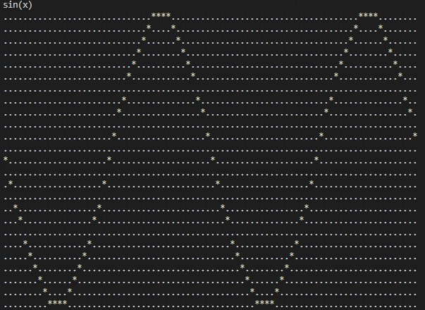
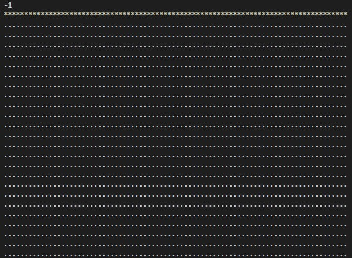
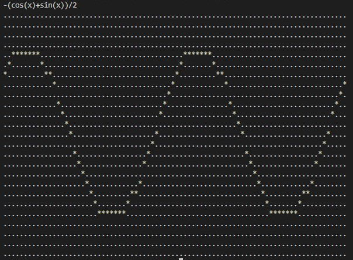

# Reverse Polish Notation (RPN) graph plotter
### Pet Project (summer 2024)

This project evaluates mathematical expressions in Reverse Polish Notation (RPN) and creates a simple text-based graph of the function. It is implemented in C and includes custom code for expression evaluation and graph plotting.

## Description

The RPN Graph Plotter converts RPN mathematical expressions into a visual graph. It processes the input expression, computes values, and displays a graph using ASCII characters in the terminal. The project covers basic expression handling, stack operations, and graph rendering.

## Features

- **Expression handling**: Converts infix expressions to postfix and evaluates them.
- **Mathematical functions**: Includes sine, cosine, tangent, and square root functions.
- **Graph plotting**: Shows a graph of the function using ASCII characters.
- **Range**: The graph is plotted in the range from `0` to `4 * PI` with adjustable step sizes. With the OY axis direction down
- **Supported operations and functions**:
  - Binary operations: `+`, `-`, `*`, `/`
  - Unary operations: `-`
  - Parentheses: `()`
  - Functions: `sin(x)`, `cos(x)`, `tan(x)`, `ctg(x)`, `sqrt(x)`, `ln(x)`

## Usage

1. **Clone the repository:**
    ```bash
    git clone https://github.com/your_username/your_repository.git
    ```

2. **Change to the project directory:**
    ```bash
    cd your_repository
    ```

3. **Compile the project**: Run the following command
    ```bash
    make
    ```

4. **Run the program**: Start the application with
    ```bash
    ./build/graph
    ```

5. **Enter an expression**: Type a mathematical expression in RPN format when prompted.

6. **Makefile commands**:
    - `make` - Build the project
    - `make clean` - Remove build files
    - `make format` - Format code with clang-format
    - `make cppcheck` - Analyze code with cppcheck

## Screenshots

### Example graph: sin(x)

### Example graph: sin(2x)

### Example graph: -1

### Example graph: ctg(x)

### Example graph: tg(x)

### Example graph: -(cos(x)+sin(x))/2


## File Structure

- `graph.c`: Main file with the `main` function.
- `functions_step_1.c`: String manipulation and function replacement.
- `functions_step_2.c`: Stack operations and infix-to-postfix conversion.
- `functions_step_3.c`: Expression evaluation and stack management.
- `functions_step_4.c`: Graph plotting.
- `graph.h`: Header file with function prototypes and structures.
- `Makefile`: Build instructions.
- `.clang-format`: Code formatting settings.
- `materials/`: Screenshots and other files.
- `README.md`: This file.
